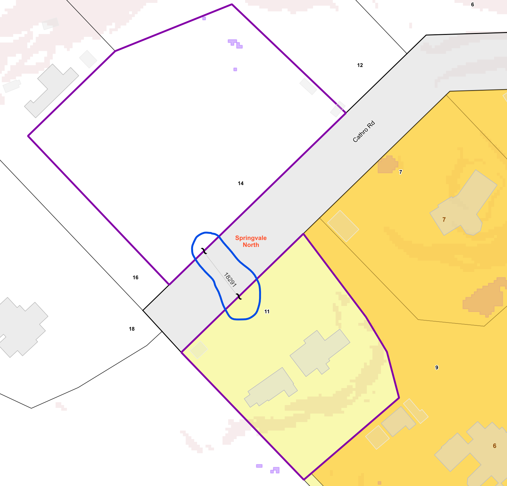

# Property-Vinculums

PostgreSQL procedure to create materialized view for Property Vinculum < 500m

**Property Vinculums** indicate that two or more physically separated areas of land belong to and form a single, unified property

